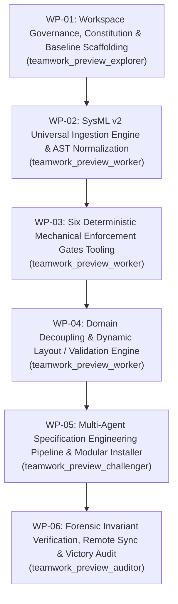

# Task Prompt: Clean-Slate Specification Core Compiler Architecture (DEAP02-spec-core)

## 1. Executive Mission & System Objective

You are the Autonomous Multi-Agent Engineering Team deployed on **DEAP02-spec-core** (Digital Engineering Agent Platform Core Specification Compiler).

Target Workspace: `.` (Workspace root of `DEAP02-spec-core`)  
Remote Repository: `https://github.com/gintatkinson/DEAP02-spec-core.git`  
Target Branch: `main`  
Repository Classification: `UPSTREAM_SPEC_CORE_COMPILER`

Your mission is to establish, implement, and verify the pristine, clean-slate DEAP specification compiler. DEAP02-spec-core is an abstract Model-Based Systems Engineering (MBSE) compiler and verification framework that ingests heterogeneous normative industry standards, transforms them into canonical SysML v2 Intermediate Representation (IR) models, enforces six deterministic mechanical verification gates, and orchestrates downstream feature-driven specification generation without human-in-the-loop intervention.

---

## 2. Core Architecture Blueprints (Workspace-Relative SSOT)

The implementation and verification of DEAP02-spec-core are strictly governed by the three architectural blueprints located in `docs/designs/`:

1. **SysML v2 Universal Ingestion Engine Blueprint**:
   [sysmlv2-universal-ingestion-blueprint.md](docs/designs/sysmlv2-universal-ingestion-blueprint.md)  
   Defines multi-schema domain neutrality, the Domain-to-SysML v2 metamodel mapping matrix, canonical textual SysML v2 (`.sysml`) synthesis, formal EBNF grammar validation, and the downstream execution flag (`is_sysml=True`) for 3-layer semantic definition of done.

2. **Six Mechanical Enforcement Gates Solution Blueprint**:
   [six-mechanical-enforcement-gates-blueprint.md](docs/designs/six-mechanical-enforcement-gates-blueprint.md)  
   Defines the six physical enforcement mechanisms stopping non-compliant executions before state mutation: Pre-Dispatch Schema Ingestion (`schema-digest.json`), Runtime Capability Pre-Flight Probe, Subagent Output Integrity Validator, Template Placeholder Escape Tokens, Shift-Left Registration Phase Gate, and Plan-to-Schema Cross-Reference Gate.

3. **Domain Decoupling and Dynamic Layout/Validation Solution**:
   [feat-domain-decoupling-solution.md](docs/designs/feat-domain-decoupling-solution.md)  
   Defines the complete elimination of hardcoded domain validators, introducing generic constraint validation (`validateFields`), dynamic property grid rendering driven by schema descriptors, and decoupled baseline conformance gates.

---

## 3. Strict Architectural & Governance Invariants

All agents and tasks must strictly comply with the following non-negotiable repository invariants:

1. **Pure Schema-Driven Compiler Invariant (Zero Hardcoded Domain Concepts)**:
   - The platform is an abstract MBSE compiler, NOT a domain-specific modeler.
   - Agents are strictly prohibited from embedding hardcoded domain concepts (specifically drone, uav, sora, aerospace, matlab, simulink, stanag) into compiler logic, schemas, rules, or templates.
   - Any mention of domain concepts in compiler code, documentation, or plans must appear solely within explicit negative prohibitions.
   - All specification items (Epics, Features, User Stories, Use Cases, Safety Invariants) derive exclusively and deterministically from AST nodes present in input schemas.

2. **Strict Prohibition of Unit Tests & Exclusive Semantic Acceptance Testing Mandate**:
   - Creating, maintaining, or executing unit test suites (`tests/`, `test_*.py`, `pytest`) is strictly forbidden across this repository.
   - All verification across the pipeline must be conducted exclusively via end-to-end semantic acceptance testing against real schemas (`scripts/verify_downstream_baseline.py`, `scripts/e2e_acceptance_harness.py`, `sysmlv2_ingest.py`).

3. **Upstream Distribution Template Clean Landing Zone Invariant**:
   - The directories `schema/`, `docs/epics/`, `docs/features/`, `docs/user-stories/`, and `docs/use-cases/` must remain clean landing zones containing only `.gitkeep` files in this repository.
   - Concrete project schemas and domain specifications belong exclusively in downstream workspaces installed via `scripts/install_pipeline.sh`.

4. **Mandatory Workspace-Relative Paths Invariant**:
   - All source code, configuration, documentation, scripts, and links MUST use workspace-relative paths (`.`, `./...`, `docs/...`).
   - Hardcoded workstation, environment-specific, or user-specific machine paths are strictly prohibited across all files.

5. **Strict Planning Gate & Coordinator Direct-Write Lock**:
   - Direct writing to repository source or specification files by coordinator agents is locked (`ENFORCED_LOCK=TRUE`).
   - All functional specifications, tooling scripts, and source writes must be delegated to context-isolated subagents.

6. **Remote Synchronization Mandate**:
   - No work package is complete until all changes are committed and pushed to `origin/main`.
   - `git diff origin/main` must return exactly 0 bytes before declaring task completion.

7. **Zero Em Dash Invariant**:
   - Unicode em dashes (`\u2014`) are strictly forbidden across all files, commit messages, and logs. Use ASCII `--` or `-` exclusively.

8. **Commit Message Non-Closure Invariant**:
   - Auto-closing keywords (`fix`, `fixes`, `close`, `closes`, `resolve`, `resolves`) are strictly prohibited in commit messages.
   - Use neutral citations exclusively: `(refs #<id>)` or `(#<id>)`.

---

## 4. Multi-Agent Work Packages (WP-01 through WP-06)

Execute the following six atomic work packages sequentially using the `/teamwork-preview` multi-agent protocol:

### WP-01: Workspace Governance, Constitution & Baseline Scaffolding
- **Assigned Role**: `teamwork_preview_explorer` (Governance Architect)
- **Objective**: Establish the repository constitution, core rules, landing zones, and root governance.
- **Tasks**:
  1. Author `.pipeline/constitution.md` establishing the two-tier governance model (platform-agnostic functional specification layer vs. platform-specific profiles).
  2. Author `AGENTS.md` and `CLAUDE.md` incorporating the Pure Schema-Driven Compiler Invariant, Strict Prohibition of Unit Tests, Clean Landing Zone Invariant, and Strict Planning Gate.
  3. Initialize clean landing zone directories with `.gitkeep`: `schema/`, `docs/epics/`, `docs/features/`, `docs/user-stories/`, `docs/use-cases/`.
  4. Author foundational rules under `rules/`: platform independence, UML model integrity, document references, and subagent dispatch standards.
  5. Assemble `.pipeline/ACTIVE_RULES_BUNDLE.md` containing all active rules with table of contents and anchor links.
- **Completion Criteria**: Complete governance scaffold established; clean landing zones initialized; zero domain pollution.

### WP-02: SysML v2 Universal Ingestion Engine & AST Normalization
- **Assigned Role**: `teamwork_preview_worker` (Core Compiler Engineer)
- **Reference Blueprint**: [sysmlv2-universal-ingestion-blueprint.md](docs/designs/sysmlv2-universal-ingestion-blueprint.md)
- **Objective**: Build the multi-format schema parser and SysML v2 IR code generation pipeline.
- **Tasks**:
  1. Implement domain schema parsers in `scripts/sysmlv2_ingest.py` supporting ASN.1, ARXML, OPC UA NodeSet XML, Protobuf (.proto), OpenAPI 3.0/3.1, OMG IDL, and IETF YANG.
  2. Implement intermediate representation classes: `SysMLPackage`, `SysMLPartDef`, `SysMLAttributeDef`, `SysMLActionDef`, and `SysMLPortDef`.
  3. Implement canonical SysML v2 textual code generator producing standard `.sysml` files conforming to the formal EBNF grammar in Section 4 of the blueprint.
  4. Implement EBNF grammar validation verifying that synthesized `.sysml` artifacts parse without syntax errors.
  5. Implement downstream context forwarder setting `is_sysml=True` to trigger the 3-layer LUI semantic definition of done (Domain State -> Logic State -> Display/Actuator Binding).
- **Completion Criteria**: Multi-schema ingestion operational; valid SysML v2 text synthesized and EBNF-verified; downstream handoff flag verified.

### WP-03: Six Deterministic Mechanical Enforcement Gates Tooling
- **Assigned Role**: `teamwork_preview_worker` (Quality Systems Engineer)
- **Reference Blueprint**: [six-mechanical-enforcement-gates-blueprint.md](docs/designs/six-mechanical-enforcement-gates-blueprint.md)
- **Objective**: Implement and verify the six mechanical verification gate scripts.
- **Tasks**:
  1. Implement Mechanism 1: `scripts/generate_schema_digest.py` computing SHA-256 hash and exact node cardinalities (containers, lists, leaves, typedefs, identities, groupings) outputting `schema-digest.json`.
  2. Implement Mechanism 2: `scripts/probe_subagent_capability.py` executing a pre-flight probe check before Phase 2 and Phase 3 dispatches, enforcing immediate coordinator lock upon failure.
  3. Implement Mechanism 3: `scripts/verify_subagent_output.py` asserting non-zero file sizes, verified file creation proof, valid tracker issue URLs, and closed Mermaid fences.
  4. Implement Mechanism 4: `scripts/check_template_escape_tokens.py` scanning draft specifications for unreplaced `{{REQUIRED_JUSTIFICATION}}`, `{{REQUIRED_SOURCE_REF}}`, and `{{REQUIRED_LUI}}` tokens, exiting with code 42 on detection.
  5. Implement Mechanism 5: `scripts/validate_shift_left_phase_gate.py` verifying Use Case flow integrity (Preconditions, Main Success Scenario steps, Postconditions) and realization matrix completeness at registration time.
  6. Implement Mechanism 6: `scripts/verify_plan_schema_cross_ref.py` asserting `union(plan_mapped_nodes) == 100%` of elements in `schema-digest.json`.
- **Completion Criteria**: All six gate scripts implemented, tested via semantic fixtures, and conforming to their JSON schema specifications.

### WP-04: Domain Decoupling & Dynamic Layout / Validation Engine
- **Assigned Role**: `teamwork_preview_worker` (Dynamic Systems Engineer)
- **Reference Blueprint**: [feat-domain-decoupling-solution.md](docs/designs/feat-domain-decoupling-solution.md)
- **Objective**: Implement generic schema-driven validation and dynamic property layout systems.
- **Tasks**:
  1. Implement generic dynamic field validator `validateFields` supporting `isRequired`, `minValue`/`maxValue`, `pattern`, and `enumOptions` against dynamic `FieldDescriptor` lists.
  2. Implement dynamic property grid component that loops over `logicalLayout.attributes` dynamically grouped by `sectionGroup`.
  3. Decouple baseline verification in `scripts/verify_downstream_baseline.py`, replacing static class requirements with dynamic schema reflection.
  4. Verify zero hardcoded domain validators exist across compiler logic.
  5. Enforce strict negative prohibitions: verify zero hardcoded domain concepts (specifically drone, uav, sora, aerospace, matlab, simulink, stanag) exist in compiler logic.
- **Completion Criteria**: Pure schema-driven validation engine verified; dynamic property grid functional; zero hardcoded domain concepts.

### WP-05: Multi-Agent Specification Engineering Pipeline & Modular Installer
- **Assigned Role**: `teamwork_preview_challenger` (Integration & Pipeline Engineer)
- **Objective**: Establish specialized multi-agent skills, modular Python installer, and semantic acceptance test harness.
- **Tasks**:
  1. Port and establish specialized specification skills:
     - `skills/spec-orchestrator/`: End-to-end multi-agent protocol orchestration.
     - `skills/schema-specification-engineering/`: Epics and Features extraction from schemas.
     - `skills/spec-user-story-engineering/`: BDD User Stories and sequence diagrams.
     - `skills/spec-usecase-engineering/`: UML System Use Cases and realization matrices.
     - `skills/spec-wbs-engineering/`: MIL-STD-881E Work Breakdown Structures.
  2. Implement modular Python installer under `scripts/installer/` (`cli.py`, `metadata.py`, `staging.py`, `tracker.py`, `scaffolding.py`, `rollback.py`) with atomic staging in temporary directories.
  3. Rewrite `scripts/install_pipeline.sh` as a lightweight bootstrap shell wrapper (<150 lines, signal trapping `trap cleanup EXIT ERR INT TERM`, zero inline Python snippets).
  4. Implement backlog reconciler `scripts/reconcile_backlog.py` and semantic acceptance test harness `scripts/e2e_acceptance_harness.py`.
  5. Enforce Strict Prohibition of Unit Tests: verify 0 unit test files (`tests/`, `test_*.py`, `pytest`) exist in the repository.
- **Completion Criteria**: Multi-agent skills operational; modular installer verified via cold install; semantic acceptance harness passing.

### WP-06: Forensic Invariant Verification, Remote Sync & Victory Audit
- **Assigned Role**: `teamwork_preview_auditor` (Independent Victory Auditor)
- **Objective**: Execute empirical verification across all invariants, perform remote synchronization, and deliver victory audit.
- **Tasks**:
  1. Execute all six mechanical verification gates: assert exit code 0 across all gates.
  2. Verify clean landing zones: assert `schema/`, `docs/epics/`, `docs/features/`, `docs/user-stories/`, and `docs/use-cases/` contain only `.gitkeep`.
  3. Verify workspace path cleanliness: assert 0 occurrences of machine-specific absolute paths.
  4. Verify legacy reference cleanliness: assert 0 references to legacy repositories.
  5. Execute Gate 6 domain cleanliness check: assert `grep -rn -i -E "drone|uav|sora|aerospace|matlab|simulink|stanag" . | grep -v "\.git/"` returns only explicit negative prohibitions.
  6. Execute unit test prohibition audit: assert 0 unit test files exist (`find . -name "test_*.py" -not -path "./.git/*"` returns 0 results).
  7. Commit all staged files with neutral citations (e.g. `(refs #01)`).
  8. Push to remote tracking branch: `git push origin main`.
  9. Verify remote synchronization: assert `git diff origin/main` returns exactly 0 bytes.
  10. Compile and deliver comprehensive Victory Audit Report.
- **Completion Criteria**: All empirical gates verified; remote diff 0 bytes; victory audit delivered.

---

## 5. Execution Protocol

Execute work packages sequentially. For each package:
1. Verify working tree state prior to execution.
2. Dispatch the assigned context-isolated subagent with clear role, scope, and instructions.
3. Validate subagent deliverables using `scripts/verify_subagent_output.py`.
4. Ensure all newly authored code conforms to the 8 non-negotiable invariants.
5. Reconcile backlog and progress before transitioning to the subsequent work package.
