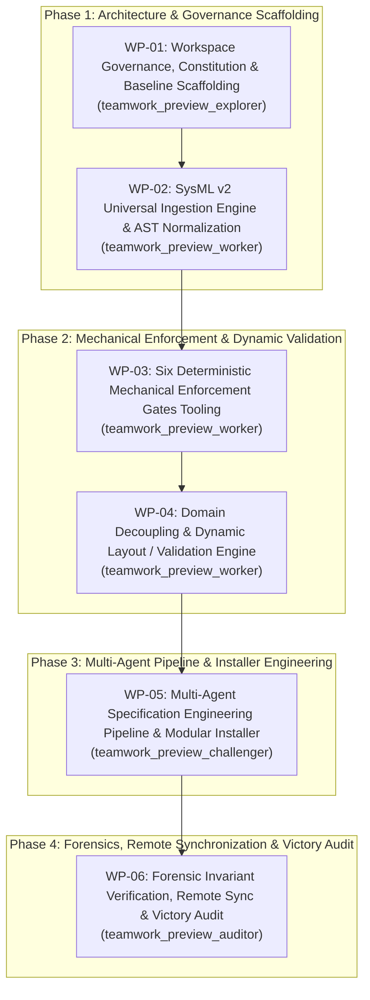

# Implementation Plan: Clean-Slate Specification Core Compiler Architecture (DEAP02-spec-core)

## 1. Executive Summary & Objective

This implementation plan governs the end-to-end realization of **DEAP02-spec-core** (Digital Engineering Agent Platform Core Specification Compiler). DEAP02-spec-core is a pristine, clean-slate Model-Based Systems Engineering (MBSE) compiler designed to transform arbitrary normative industry schemas into canonical SysML v2 Intermediate Representation (IR) system models, enforce six deterministic mechanical verification gates, and orchestrate automated, multi-agent specification synthesis without domain hardcoding.

The implementation is anchored in three core architectural blueprints:
- [sysmlv2-universal-ingestion-blueprint.md](docs/designs/sysmlv2-universal-ingestion-blueprint.md): Multi-schema domain neutrality, AST normalization, SysML v2 textual code generation, EBNF syntax checking, and downstream 3-layer semantic flow (`is_sysml=True`).
- [six-mechanical-enforcement-gates-blueprint.md](docs/designs/six-mechanical-enforcement-gates-blueprint.md): Deterministic mechanical gates preventing non-compliant mutations (Pre-Dispatch Digest, Pre-Flight Probe, Subagent Output Integrity, Escape Token Elimination, Shift-Left Registration Gate, Plan-to-Schema Cross-Reference).
- [feat-domain-decoupling-solution.md](docs/designs/feat-domain-decoupling-solution.md): Dynamic schema-driven validation engine (`validateFields`), dynamic property grid rendering, and complete elimination of hardcoded domain concepts.

---

## 2. Multi-Agent Team Architecture & Workflow Sequence

The execution is structured into six atomic work packages (WP-01 through WP-06) across four distinct phases:

---

## 3. Detailed Work Packages

### WP-01: Workspace Governance, Constitution & Baseline Scaffolding
- **Assigned Subagent**: `teamwork_preview_explorer` (Role: `Governance Architect`)
- **Directives & Constraints**:
  - Establish `.pipeline/constitution.md` with two-tier governance (abstract platform-independent specifications vs. platform-specific profiles).
  - Scaffold `AGENTS.md` and `CLAUDE.md` incorporating the Pure Schema-Driven Compiler Invariant, Strict Prohibition of Unit Tests, and Upstream Clean Landing Zone Invariant.
  - Create clean landing zone directories with `.gitkeep` files: `schema/`, `docs/epics/`, `docs/features/`, `docs/user-stories/`, `docs/use-cases/`.
  - Compile `rules/` into `.pipeline/ACTIVE_RULES_BUNDLE.md` with table of contents and anchor links.
- **Target Deliverables**:
  - `.pipeline/constitution.md`
  - `AGENTS.md`
  - `CLAUDE.md`
  - `.pipeline/ACTIVE_RULES_BUNDLE.md`
  - `schema/.gitkeep`, `docs/epics/.gitkeep`, `docs/features/.gitkeep`, `docs/user-stories/.gitkeep`, `docs/use-cases/.gitkeep`
- **Completion Criteria**: Complete governance and landing zone scaffolding established; zero hardcoded domain concepts.

### WP-02: SysML v2 Universal Ingestion Engine & AST Normalization
- **Assigned Subagent**: `teamwork_preview_worker` (Role: `Core Compiler Engineer`)
- **Directives & Constraints**:
  - Implement multi-format domain schema parsers in `scripts/sysmlv2_ingest.py` supporting ASN.1, ARXML, OPC UA NodeSet XML, Protobuf, OpenAPI 3.0/3.1, OMG IDL, and IETF YANG.
  - Implement SysML v2 metamodel classes (`SysMLPackage`, `SysMLPartDef`, `SysMLAttributeDef`, `SysMLActionDef`, `SysMLPortDef`).
  - Implement textual code generator producing canonical `.sysml` artifacts conforming to the formal EBNF grammar defined in [sysmlv2-universal-ingestion-blueprint.md](docs/designs/sysmlv2-universal-ingestion-blueprint.md).
  - Implement EBNF syntax validator asserting zero syntax errors on generated models.
  - Implement execution context dispatcher setting `is_sysml=True` to enforce 3-layer semantic definition of done (Domain State -> Logic State -> Display/Actuator Binding).
- **Target Deliverables**:
  - `scripts/sysmlv2_ingest.py`
  - `scripts/validate_sysml_ebnf.py`
  - `skills/sysmlv2-schema-ingestion/SKILL.md`
- **Completion Criteria**: Multi-schema ingestion operational; valid SysML v2 text generated and EBNF-verified; downstream handoff flag verified.

### WP-03: Six Deterministic Mechanical Enforcement Gates Tooling
- **Assigned Subagent**: `teamwork_preview_worker` (Role: `Quality Systems Engineer`)
- **Directives & Constraints**:
  - Implement all six mechanical enforcement mechanisms defined in [six-mechanical-enforcement-gates-blueprint.md](docs/designs/six-mechanical-enforcement-gates-blueprint.md):
    1. **Mechanism 1 (Pre-Dispatch Digest)**: `scripts/generate_schema_digest.py` computing SHA-256 and cardinalities of containers, lists, leaves, typedefs, identities, groupings into `schema-digest.json`.
    2. **Mechanism 2 (Pre-Flight Probe)**: `scripts/probe_subagent_capability.py` verifying subagent tool access and locking coordinator direct writes on probe failure.
    3. **Mechanism 3 (Output Integrity Validator)**: `scripts/verify_subagent_output.py` asserting non-zero file sizes, physical creation proof, valid tracker URLs, and matching Mermaid fences.
    4. **Mechanism 4 (Template Placeholder Escape Tokens)**: `scripts/check_template_escape_tokens.py` scanning for unreplaced `{{REQUIRED_*}}` tokens and exiting with code 42 on detection.
    5. **Mechanism 5 (Shift-Left Registration Phase Gate)**: `scripts/validate_shift_left_phase_gate.py` asserting Use Case flow validity and realization matrix completeness prior to issue creation or commit.
    6. **Mechanism 6 (Plan-to-Schema Cross-Reference Gate)**: `scripts/verify_plan_schema_cross_ref.py` verifying that `union(plan_mapped_nodes) == 100%` of nodes in `schema-digest.json`.
- **Target Deliverables**:
  - `scripts/generate_schema_digest.py`
  - `scripts/probe_subagent_capability.py`
  - `scripts/verify_subagent_output.py`
  - `scripts/check_template_escape_tokens.py`
  - `scripts/validate_shift_left_phase_gate.py`
  - `scripts/verify_plan_schema_cross_ref.py`
- **Completion Criteria**: All six mechanical gate scripts operational, conforming to EBNF and JSON schema specifications.

### WP-04: Domain Decoupling & Dynamic Layout / Validation Engine
- **Assigned Subagent**: `teamwork_preview_worker` (Role: `Dynamic Systems Engineer`)
- **Directives & Constraints**:
  - Implement generic schema validation engine `validateFields` supporting `isRequired`, `minValue`/`maxValue`, `pattern`, and `enumOptions` against dynamic `FieldDescriptor` lists.
  - Implement dynamic property grid component mapping `logicalLayout.attributes` dynamically grouped by `sectionGroup`.
  - Decouple baseline verification in `scripts/verify_downstream_baseline.py` from hardcoded domain classes, relying exclusively on dynamic AST queries.
  - Enforce pure schema-driven compiler invariant: hardcoded domain concepts (specifically drone, uav, sora, aerospace, matlab, simulink, stanag) are strictly prohibited from compiler logic.
- **Target Deliverables**:
  - `scripts/validate_dynamic_fields.py`
  - `scripts/verify_downstream_baseline.py`
  - `docs/designs/feat-domain-decoupling-solution.md`
- **Completion Criteria**: Generic dynamic validation verified; baseline gate decoupled; zero hardcoded domain concepts.

### WP-05: Multi-Agent Specification Engineering Pipeline & Modular Installer
- **Assigned Subagent**: `teamwork_preview_challenger` (Role: `Integration & Pipeline Engineer`)
- **Directives & Constraints**:
  - Establish context-isolated specification engineering skills:
    - `skills/spec-orchestrator/`: Multi-agent protocol specification orchestration.
    - `skills/schema-specification-engineering/`: Schema-to-Epic and Feature extraction.
    - `skills/spec-user-story-engineering/`: BDD User Stories and sequence message flows.
    - `skills/spec-usecase-engineering/`: UML System Use Cases and realization matrices.
    - `skills/spec-wbs-engineering/`: MIL-STD-881E Work Breakdown Structures.
  - Build modular Python installer package `scripts/installer/` with atomic directory staging in `tempfile.TemporaryDirectory()`, safe metadata restoration, and rollback handlers.
  - Implement lightweight bootstrap wrapper `scripts/install_pipeline.sh` (<150 lines, signal traps `trap cleanup EXIT ERR INT TERM`, zero inline Python snippets).
  - Implement backlog reconciler `scripts/reconcile_backlog.py` and semantic acceptance test harness `scripts/e2e_acceptance_harness.py`.
  - Enforce strict unit test prohibition: zero unit test suites (`tests/`, `test_*.py`, `pytest`) permitted in repository.
- **Target Deliverables**:
  - `skills/spec-orchestrator/SKILL.md`
  - `skills/schema-specification-engineering/SKILL.md`
  - `skills/spec-user-story-engineering/SKILL.md`
  - `skills/spec-usecase-engineering/SKILL.md`
  - `skills/spec-wbs-engineering/SKILL.md`
  - `scripts/installer/cli.py`
  - `scripts/installer/staging.py`
  - `scripts/installer/metadata.py`
  - `scripts/installer/scaffolding.py`
  - `scripts/installer/tracker.py`
  - `scripts/installer/rollback.py`
  - `scripts/install_pipeline.sh`
  - `scripts/reconcile_backlog.py`
  - `scripts/e2e_acceptance_harness.py`
- **Completion Criteria**: Multi-agent skills operational; modular installer verified via cold install; semantic acceptance harness passing with exit code 0.

### WP-06: Forensic Invariant Verification, Remote Sync & Victory Audit
- **Assigned Subagent**: `teamwork_preview_auditor` (Role: `Independent Victory Auditor`)
- **Directives & Constraints**:
  - Execute full empirical verification of all six mechanical gates (exit code 0).
  - Verify clean landing zones: assert `schema/`, `docs/epics/`, `docs/features/`, `docs/user-stories/`, and `docs/use-cases/` contain only `.gitkeep`.
  - Verify workspace-relative path cleanliness: assert 0 occurrences of machine-specific absolute paths.
  - Verify legacy reference cleanliness: assert 0 occurrences of legacy repository identifiers.
  - Execute Gate 6 domain cleanliness check: assert `grep -rn -i -E "drone|uav|sora|aerospace|matlab|simulink|stanag" . | grep -v "\.git/"` returns only explicit negative prohibitions.
  - Execute unit test prohibition audit: assert 0 unit test files exist (`find . -name "test_*.py" -not -path "./.git/*"` returns 0 results).
  - Commit all staged assets using neutral issue citations (e.g. `(refs #01)`).
  - Push to remote tracking branch: `git push origin main`.
  - Verify remote synchronization: assert `git diff origin/main` returns exactly 0 bytes.
  - Author and deliver comprehensive Victory Audit Report.
- **Target Deliverables**:
  - `docs/audits/victory_audit_report.md`
- **Completion Criteria**: All empirical gates verified; remote diff 0 bytes; victory audit approved.

---

## 4. Invariant Governance & Compliance Matrix

| Invariant | Scope & Requirement | Verification Standard |
|---|---|---|
| **Pure Schema-Driven Compiler** | Zero hardcoded domain concepts. Mentions of drone, uav, sora, aerospace, matlab, simulink, stanag must only be explicit negative prohibitions. | `grep -rn -i -E "drone|uav|sora|aerospace|matlab|simulink|stanag" . \| grep -v "\.git/"` returns only negative prohibitions. |
| **Strict Unit Test Prohibition** | Unit test suites (`tests/`, `test_*.py`, `pytest`) strictly forbidden. Verification via semantic acceptance testing exclusively. | `find . -name "test_*.py" -not -path "./.git/*"` returns 0 results. |
| **Clean Landing Zone** | Upstream landing zones (`schema/`, `docs/epics/`, `docs/features/`, `docs/user-stories/`, `docs/use-cases/`) contain only `.gitkeep`. | Directory check confirms only `.gitkeep` files present. |
| **Workspace-Relative Paths** | Zero hardcoded machine paths; strictly workspace-relative paths throughout. | Verification script confirms zero host-specific machine paths across workspace. |
| **Legacy Reference Isolation** | Zero references to legacy compiler repositories. | Verification script confirms zero legacy repository identifiers across workspace. |
| **Remote Synchronization** | Local branch synchronized with remote tracking branch. | `git diff origin/main` returns exactly 0 bytes. |
| **Zero Em Dash Invariant** | Unicode em dashes (`\u2014`) strictly forbidden. | Python scanner finds 0 instances of `\u2014`. |
| **Commit Message Neutrality** | No auto-closing keywords (`fix`, `resolve`, `close`); neutral citations only. | Commit log audit confirms neutral citations `(refs #...)`. |

---

## 5. Verification Gates Matrix

| Gate | Target Script / Command | Acceptance Criteria |
|---|---|---|
| **Gate 1: Pre-Dispatch Digest** | `python3 scripts/generate_schema_digest.py <schema>` | Generates valid `schema-digest.json` with SHA-256 and cardinalities |
| **Gate 2: Pre-Flight Probe** | `python3 scripts/probe_subagent_capability.py` | Exits code 0 on probe success; enforces coordinator lock on failure |
| **Gate 3: Subagent Output Integrity** | `python3 scripts/verify_subagent_output.py --manifest <manifest>` | Non-zero sizes, physical creation proof, valid issue URLs |
| **Gate 4: Template Escape Tokens** | `python3 scripts/check_template_escape_tokens.py` | Exits code 0 if clear; exits code 42 if `{{REQUIRED_*}}` found |
| **Gate 5: Shift-Left Registration** | `python3 scripts/validate_shift_left_phase_gate.py` | Verifies Use Case flows and realization matrices before commit |
| **Gate 6: Plan-to-Schema Cross-Ref** | `python3 scripts/verify_plan_schema_cross_ref.py` | Asserts `union(mapped_nodes) == 100%` of digest nodes |
| **Installer Bootstrap Line Count** | `wc -l scripts/install_pipeline.sh` | `< 150` lines |
| **Installer Shell Inline Python** | `grep -c "python3 -c" scripts/install_pipeline.sh` | `0` occurrences |
| **Semantic Acceptance Harness** | `python3 scripts/e2e_acceptance_harness.py` | Exits code 0 across cold install and pipeline verification |
| **Downstream Baseline Gate** | `python3 scripts/verify_downstream_baseline.py .` | Exits code 0 across all structural baseline checks |
| **Remote Synchronization Gate** | `git diff origin/main` | Exactly `0` bytes |
